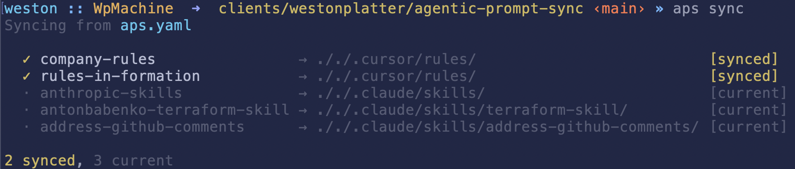

<div align="center"> <!-- markdownlint-disable MD033 MD041 -->

# Agentic Prompt Sync (aps)

**Compose and sync your own collection of AGENTS.md, Skills, and other agentic prompts.**

[](https://github.com/westonplatter/aps/actions/workflows/ci.yml)
[](https://crates.io/crates/aps)
[](https://crates.io/crates/aps)
[](https://github.com/westonplatter/aps/stargazers)
[](LICENSE)

**Cross-platform support:** macOS • Linux • Windows



</div>

## Features

`aps` is a manifest-driven, CLI tool for syncing agentic assets (Cursor rules, Agent Skills, and AGENTS.md files) from sources like git or your filesystem in your project folders.

- **Declarative manifest-driven sync** - Define your agentic assets in a YAML manifest
- **Composable AGENTS.md** - Merge multiple AGENTS.md files from local or remote sources into one
- **Safe installs** - Automatic conflict detection and backup creation
- **Deterministic lockfile** - Idempotent syncs that only update when needed

## Installation

### Quick Install (macOS/Linux)

Install or update `aps` using cargo

```bash
# install the latest version
cargo install aps
```

Or use curl,

```bash
curl -fsSL https://raw.githubusercontent.com/westonplatter/aps/main/install.sh | sh

# or override the install location
APS_INSTALL_DIR=/usr/local/bin curl -fsSL https://raw.githubusercontent.com/westonplatter/aps/main/install.sh | sh
```

### Download Binary

Pre-built binaries for all platforms are available on the [Releases page](https://github.com/westonplatter/aps/releases).

| Platform    | Download                    |
| ----------- | --------------------------- |
| Linux x64   | `aps-linux-x64-musl.tar.gz` |
| Linux ARM64 | `aps-linux-arm64.tar.gz`    |
| macOS Intel | `aps-macos-x64.tar.gz`      |
| macOS ARM   | `aps-macos-arm64.tar.gz`    |
| Windows x64 | `aps-windows-x64.zip`       |

### Build from Source

```bash
git clone https://github.com/westonplatter/aps.git
cd agentic-prompt-sync
cargo build --release
# Binary at target/release/aps
```

## Getting Started

### Quick Start

1. **Initialize a manifest** in your project:

   ```bash
   aps init
   ```

   This creates a `aps.yaml` manifest file with an example entry.

2. **Add skills directly from GitHub URLs:**

   ```bash
   # Add a skill from a GitHub URL - automatically syncs the skill
   aps add https://github.com/hashicorp/agent-skills/blob/main/terraform/module-generation/skills/refactor-module/SKILL.md

   # Or use the folder URL (SKILL.md is auto-detected)
   aps add https://github.com/hashicorp/agent-skills/tree/main/terraform/module-generation/skills/refactor-module
   ```

   This parses the GitHub URL, adds an entry to `aps.yaml`, and syncs **only that skill** immediately (other entries are not affected).

3. **Or manually edit the manifest** to define your assets:

   ```yaml
   entries:
     - id: my-agents
       kind: agents_md
       source:
         type: filesystem
         root: $HOME
         path: personal-generic-AGENTS.md
       dest: ./AGENTS.md
   ```

4. **Sync and install** your assets:

   ```bash
   aps sync
   ```

5. **Check status** of synced assets:

   ```bash
   aps status
   ```

## Commands

| Command        | Description                                       |
| -------------- | ------------------------------------------------- |
| `aps init`     | Create a new manifest file and update .gitignore  |
| `aps add`      | Add a skill from a GitHub URL and sync it         |
| `aps sync`     | Sync all entries from manifest and install assets |
| `aps validate` | Validate manifest schema and check sources        |
| `aps status`   | Display last sync information from lockfile       |

### Common Options

- `--verbose` - Enable verbose logging
- `--manifest <path>` - Specify manifest file path (default: `aps.yaml`)

### Add Options

- `--id <name>` - Custom entry ID (defaults to skill folder name)
- `--kind <type>` - Asset kind: `agent-skill`, `cursor-rules`, `cursor-skills-root`, `agents-md` (default: `agent-skill`)
- `--no-sync` - Only add to manifest, don't sync immediately
- `--all` - Add all discovered skills without prompting (for repo-level URLs or directories)
- `--yes` / `-y` - Skip confirmation prompts

### Skill Discovery

When you point `aps add` at a repository or directory that doesn't directly contain a `SKILL.md`, aps automatically discovers all skills within it. Skills are identified by recursively searching for directories containing a `SKILL.md` file.

**From a GitHub repository:**

```bash
# Discover all skills in a repo (or a subdirectory within it)
aps add https://github.com/anthropics/skills

# Narrow discovery to a specific path within the repo
aps add https://github.com/anthropics/skills/tree/main/skills
```

**From a local directory:**

```bash
# Discover skills in a local directory
aps add ~/my-skills

# Supports shell variable expansion
aps add $HOME/work/shared-skills
```

After discovery, aps presents an interactive toggle picker showing **all** discovered skills. Already-installed skills appear pre-checked, so you can add new skills and remove existing ones in a single pass.

```bash
Found 5 skill(s) (2 installed, 3 new):

? Toggle skills (space to toggle, enter to confirm) ›
> ✔ refactor-module  Transform monolithic Terraform configurations into reusable modules
  ✔ plan-review      Review Terraform plan output for potential issues
  ○ test-gen         Generate unit tests for Terraform modules
  ○ lint-check       Lint Terraform files for best practices
  ○ cost-estimator   Estimate cloud costs from Terraform plans
```

After confirming, aps shows a summary of changes:

```bash
  ✓ Will add: test-gen, cost-estimator
  ✗ Will remove: plan-review
  · Unchanged: refactor-module

Proceed? [Y/n]
```

To skip prompts and add everything, use `--all`. To skip the confirmation, use `--yes` / `-y`:

```bash
aps add --all https://github.com/anthropics/skills
aps add --yes https://github.com/anthropics/skills
```

### Sync Options

- `--yes` - Non-interactive mode, automatically confirm overwrites
- `--dry-run` - Preview changes without applying them
- `--only <id>` - Only sync specific entry by ID

### Sync Behavior

When you run `aps sync`:

1. **Entries are synced** - Each entry in `aps.yaml` is installed to its destination
2. **Stale entries are cleaned** - Entries in the lockfile that no longer exist in `aps.yaml` are automatically removed
3. **Lockfile is saved** - The updated lockfile is written to disk

Note: Stale entry cleanup only happens during a full sync. When using `--only <id>` to sync specific entries, other lockfile entries are preserved.

## Configuration

### Manifest File (`aps.yaml`)

```yaml
entries:
  # Single AGENTS.md file from one source
  - id: my-agents
    kind: agents_md
    source:
      type: filesystem
      root: $HOME
      path: AGENTS-generic.md
    dest: ./AGENTS-simple.md

  # Composite AGENTS.md - merge multiple markdown files into one
  - id: composite-agents
    kind: composite_agents_md
    sources:
      - type: filesystem
        root: $HOME/agents
        path: AGENT.python.md
      - type: filesystem
        root: $HOME/agents
        path: AGENT.docker.md
      - type: git
        repo: https://github.com/apache/airflow.git
        ref: main
        path: AGENTS.md
    dest: ./AGENTS.md

  # Pull in Agent Skills from a public git repo
  - id: anthropic-skills
    kind: agent_skill
    source:
      type: git
      repo: git@github.com:anthropics/skills.git
      ref: main
      path: skills
    include:
      - pdf
      - skill-creation
    dest: ./.claude/skills/

  # Pull Cursor Rules from a private git repo
  - id: personal-rules
    kind: cursor_rules
    source:
      type: git
      repo: git@github.com:your-username/dotfiles.git
      ref: main
      path: .cursor/rules
      # shallow: false  # full clone
    dest: ./.cursor/rules/

  # Pull in more Cursor Rules from a local file system
  - id: company-rules
    kind: cursor_rules
    source:
      type: filesystem
      root: $HOME/work/acme-corp/internal-prompts
      path: rules
      # symlink: false  # copy files instead of symlinking
    dest: ./.cursor/rules/
```

### Asset Types

| Kind                  | Description                            | Default Destination |
| --------------------- | -------------------------------------- | ------------------- |
| `agents_md`           | Single AGENTS.md file                  | `./AGENTS.md`       |
| `composite_agents_md` | Merge multiple markdown files into one | `./AGENTS.md`       |
| `cursor_rules`        | Directory of Cursor rules              | `./.cursor/rules/`  |
| `cursor_hooks`        | Directory of Cursor hooks              | `./.cursor/hooks/`  |
| `cursor_skills_root`  | Directory with skill subdirs           | `./.cursor/skills/` |
| `agent_skill`         | Claude agent skill directory           | `./.claude/skills/` |

### Source Types

| Type         | Description                 | Key Properties                   |
| ------------ | --------------------------- | -------------------------------- |
| `filesystem` | Sync from a local directory | `root`, `path`, `symlink`        |
| `git`        | Sync from a git repository  | `repo`, `ref`, `path`, `shallow` |

**Shell Variable Expansion**: Path values in `root` and `path` fields support shell variable expansion (e.g., `$HOME`, `$USER`). This makes manifests portable across different machines and users.

### Filtering with `include`

When a source contains multiple subdirectories (e.g., a skills repo with many skills), use the `include` field to sync only specific ones:

```yaml
- id: anthropic-skills
  kind: agent_skill
  source:
    type: git
    repo: git@github.com:anthropics/skills.git
    ref: main
    path: skills
  include:
    - pdf
    - skill-creation
  dest: ./.claude/skills/
```

Each value in `include` is matched against subdirectory names within the source `path`. Only matching subdirectories are synced. If `include` is omitted, all subdirectories are synced.

### Composite AGENTS.md

The `composite_agents_md` kind allows you to merge multiple markdown files into a single `AGENTS.md` file. This is useful when you want to organize agent definitions across separate files (e.g., by language or framework) and combine them at sync time.

```yaml
entries:
  - id: my-composite-agents
    kind: composite_agents_md
    sources:
      # Local filesystem sources
      - type: filesystem
        root: $HOME/agents-md-partials
        path: AGENT.docker.md
      # Remote git sources
      - type: git
        repo: https://github.com/westonplatter/agentically.git
        ref: main
        path: agents-md-partials/AGENTS.python.md
    dest: ./AGENTS.md
```

Key features:

- **Mixed sources**: Combine local filesystem and remote git sources
- **Order preserved**: Files are merged in the order specified in `sources`
- **Auto-generated header**: Output includes a comment indicating it was composed by aps

### Lockfile (`aps.lock.yaml`)

The lockfile tracks installed assets and is automatically created/updated by `aps sync`. **This file should be committed to version control** to ensure reproducible installations across your team. It stores:

- APS version that generated/modified the lockfile
- Source information
- Destination paths
- Last update timestamp
- Content checksum (SHA256)

**Environment Variables Are Preserved**: Unlike other package managers (npm, uv, bundler) that expand environment variables to concrete paths, `aps` preserves shell variables like `$HOME` in the lockfile. This makes lockfiles portable across different machines and users who have the same relative directory structure.

## Examples

### Non-interactive sync for CI/CD

```bash
aps sync --yes
```

### Validate manifest before sync

```bash
aps validate --strict
```

## Contributing

See [CONTRIBUTING.md](CONTRIBUTING.md) for development setup, building, testing, and linting instructions.

## Inspiration

Built based on inspiration from these other projects,

- [rule-tool](https://github.com/circleci-petri/rule-tool/)

## License

See [LICENSE](LICENSE) for details.
